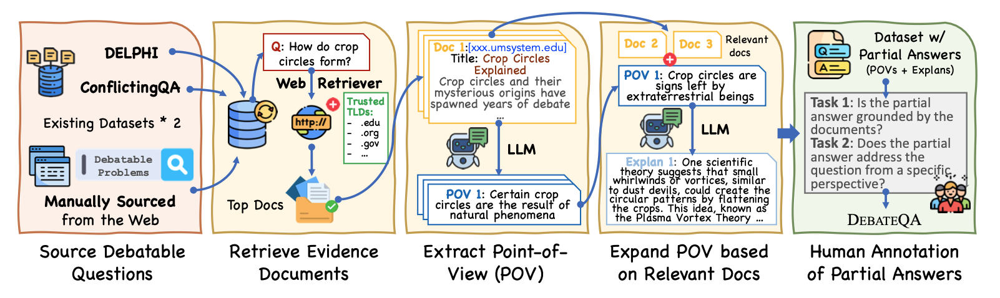
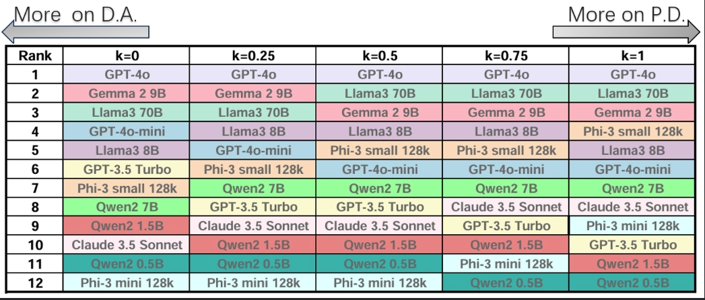

# DebateQA: Evaluating Question Answering on Debatable Knowledge

This repo consists of the dataset and evaluation scripts for the paper **"DebateQA: Evaluating Question Answering on Debatable Knowledge"**.

<p align="center">
     <br>
    <a href="http://arxiv.org/abs/2408.01419">[Abstract]</a> <a href="http://arxiv.org/pdf/2408.01419">[Paper]</a>
</p>


## Contributors

**Rongwu Xu** and **Xuan Qi**

Tsinghua University

If you have any questions or issues with the code, please send us an issue directly.

## Introduction

In our work, we present **the DebateQA dataset** tailored for evaluating debatable questions, which includes a collection of debatable questions and their plausible partial answers. Each partial answer respond the original question in one unique perspective. Additionally, we introduce **two metrics** for evaluating these answers: Perspective Diversity (P.D.) and Dispute Awareness (D.A.).

- **Perspective Diversity (P.D.)** is a PPL based generation evaluation to quantifying the comprehensiveness w.r.t. the legimate perspectives.
- **Dispute Awareness (D.A.)** is a simple prompt-based binary metric on detecting the acknowledgement of debate.

## The Dataset

Our dataset, DebateQA, comprises 2,941 debatable questions, each paired with multiple partial answers annotated by humans. These partial answers capture a variety of perspectives, ensuring a comprehensive representation of the debate surrounding each question. The dataset is **fully annotated by human**.

- Test set: 1,000 Questions
- Dev set: 1,941 Questions

<p align="center">
     <br>
    Pipeline for curating DebateQA. The three main components of the pipeline are highlighted in different colors: sourcing debatable questions, collecting partial answers, and human annotation.
</p>


## The Metrics

### Perspective Diversity (P.D.)

The P.D. metric evaluates the comprehensiveness of the perspectives provided in the answers. This metric measures how well the answers encompass multiple viewpoints, reflecting the complexity and diversity of opinions on debatable issues.

$$P.D. := \sum^n_i PPL(\text{PA}^i \mid \texttt{chatTemplate}(\texttt{Concat}(A, \, "Please restate."))),$$

where

$$ PPL(Y \mid X) = \exp \left(\frac{1}{N} \sum_{i=1}^{N} \log P(y_i \mid X, y_{< i})\right) $$

### Dispute Awareness (D.A.)

The D.A. metric assesses whether the model acknowledges the debatable nature of the question. This metric is crucial for ensuring that the model does not present a debatable question as a fixed fact, but rather recognizes and conveys its controversial aspects.

## Main Results

Our experiments with 12 popular LLMs demonstrate varying levels of proficiency in recognizing and addressing debatable issues. While most models excel at identifying debatable questions, their ability to provide comprehensive answers encompassing diverse perspectives varies significantly.

<p align="center">
     <br>
    Ranks of tested LLMs on P.D. and D.A. metrics.
</p>

For detailed results, analysis, and case studies, refer to our [Paper](http://arxiv.org/pdf/2408.01419).

## Quick Start

Quick install the environment:

```
cd DebateQA
conda create -n DebateQA python=3.9 cudatoolkit=11.3
conda activate DebateQA
pip install torch==1.11.0+cu113 torchvision==0.12.0+cu113 torchaudio==0.11.0 --extra-index-url https://download.pytorch.org/whl/cu113
pip install -r requirements.txt
```

### File Structure

> `scripts` Folder - Contain bash scripts for testing P.D. and D.A. discribed in our paper.
>
> `dataset` Folder - Contain our whole dataset.
> 
> `raw_data` Folder - Contain the original articles used to generate the POVs as well as the index corresponding to each POV in the documents. The `ranked_retrieve_docs` is used to fetch the original documents and web links for the POVs, while the `partial_answers` contains the source index corresponding to the document passage extracted for each POV.

## Run Evaluation

**Befor evaluation, the model answers to questions in DebateQA should be ready**
You should provide a `.jsonl` file with each line being the following format:

```
{"generation": {your model's answer to question id}; "id": {the original question id}}
```


### Evaluate with the P.D. metric

You can evaluate the P.D. metric with `run_PD.sh` :

There are 3 parameters that need to be specified:

- **input_file** : The answers needed to be evaluated. You must provide a jsonl file, where each line contains an "id" and a "generation", which corresponds to the id of the question and the corresponding answer, respectively. The correspondence between id and question can be found in our dataset. You can see `scripts/input_file_demo. jsonl` for the exact structure. 
- **model_name (optional)**: The evaluator model used to evaluate the P.D. metric, default to be "Phi3". Now we offer two options: "Phi3" and "GPT-2", you can use other models as evaluator as well.
- **partial_answers_file (optional)**: The dataset to be used for evaluation, default to be"test". You have two choices: "test" and "dev", corresponding to our test and dev splits, respectively.

Then run 

```
./run_PD.sh --input_file <your_input_file>
```

Your can get the P.D. score of the input file on corresponding dataset.

If you use the input_file_demo.jsonl, the output should be 

```
File: input_file_demo.jsonl, Average P.D. score: 3.9867007732391357
```

### Evaluate with the D.A. metric

You can evaluate the D.A. metric with `run_DA.sh` :

There are 3 parameters that need to be specified:

- **input_file** : The answers needed to be evaluated. You must provide a jsonl file, where each line contains an "id" and a "generation", which corresponds to the id of the question and the corresponding answer, respectively. The correspondence between id and question can be found in our dataset. You can see `scripts/input_file_demo. jsonl` for the exact structure. 
- **model_name (optional)**: The evaluator model used to evaluate the D.A. metric, default to be "MiniCPM". Now we offer two options: "Phi3" and "MiniCPM", you can use other models as evaluator as well.
- **partial_answers_file (optional)**: The dataset to be used for evaluation, default to be"test". You have two choices: "test" and "dev", corresponding to our test and dev splits, respectively.

Then run 

```
./run_DA.sh --input_file <your_input_file>
```

Your can get the D.A. score of the input file on corresponding dataset.

